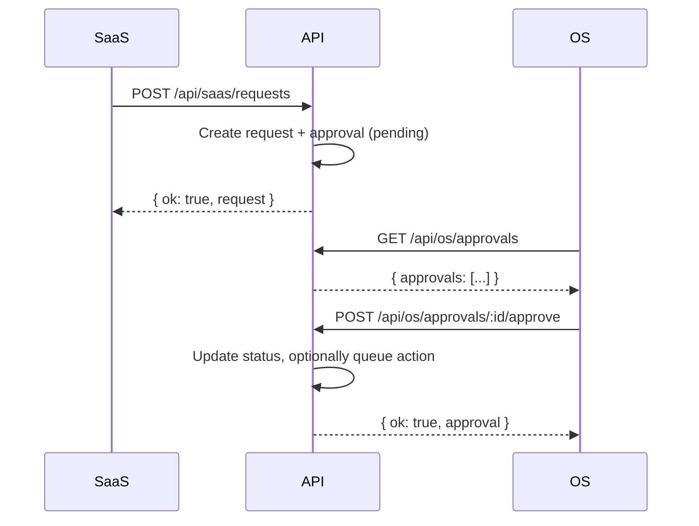

# OS vs SaaS Authority Model

MaxSam uses a two-layer authority model to separate trusted operator access from external/untrusted access.

## Overview

```
┌─────────────────────────────────────────────────────────────┐
│                    MaxSam Core Brain                         │
│                 (Ralph + Eleanor + Sam)                      │
└─────────────────────────────────────────────────────────────┘
                            │
        ┌───────────────────┴───────────────────┐
        │                                       │
        ▼                                       ▼
┌───────────────────┐               ┌───────────────────┐
│   OS (Operator)   │               │  SaaS (External)  │
│                   │               │                   │
│ • Full control    │               │ • Read-only       │
│ • Direct execute  │               │ • Request-based   │
│ • Approvals       │               │ • Approval-gated  │
│ • Internal data   │               │ • Curated data    │
└───────────────────┘               └───────────────────┘
```

## Authority Header

All requests must include the `x-maxsam-authority` header:

| Header Value | Access Level | Description |
|--------------|--------------|-------------|
| `os` | Full | Operator access, direct execution, internal data |
| `saas` | Limited | Read-only, request-only, curated data |
| (missing) | Default to `saas` | Least privilege |

## Route Namespaces

### OS Routes (`/api/os/**`) - Trusted Execution

| Route | Method | Description |
|-------|--------|-------------|
| `/api/os/execute` | POST | Execute actions directly on leads |
| `/api/os/approvals` | GET | List pending SaaS requests for review |
| `/api/os/approvals/:id/approve` | POST | Approve a SaaS request |
| `/api/os/approvals/:id/reject` | POST | Reject a SaaS request |

### SaaS Routes (`/api/saas/**`) - Projection Layer

| Route | Method | Description |
|-------|--------|-------------|
| `/api/saas/leads` | GET | Curated lead data (no internal fields) |
| `/api/saas/requests` | GET | List requests and statuses |
| `/api/saas/requests` | POST | Create a request (awaiting approval) |

### Shared Routes - Data Retrieval

| Route | Method | Description |
|-------|--------|-------------|
| `/api/leads` | GET | Full lead data (used by Command Center) |
| `/api/leads` | POST | Create lead |
| `/api/leads/:id` | GET/PUT | Lead CRUD |

## Data Exposure

### OS (Full Access)
- All lead fields including:
  - `eleanor_reasoning` (internal scoring logic)
  - `contact_priority` (internal classification)
  - `deal_grade` (internal scoring)
  - Phone numbers, emails, full contact info

### SaaS (Curated)
Only these fields are exposed via `/api/saas/leads`:
- `id`
- `owner_name`
- `property_address`
- `city`
- `state`
- `excess_funds_amount`
- `eleanor_score`
- `status`
- `updated_at`

**Not exposed:** phone, email, internal reasoning, agent metadata

## Approval Workflow

1. SaaS creates a request via `POST /api/saas/requests`
2. Request is stored with `status: pending`
3. An approval record is created
4. OS reviews via `GET /api/os/approvals`
5. OS approves or rejects via `POST /api/os/approvals/:id/approve|reject`
6. If approved with `createQueuedAction: true`, a Ralph task is created



## Testing Locally

### OS Execute (requires `x-maxsam-authority: os`)
```bash
curl -X POST http://localhost:3000/api/os/execute \
  -H "Content-Type: application/json" \
  -H "x-maxsam-authority: os" \
  -d '{"leadId": "uuid", "actionType": "send_sms"}'
```

### SaaS Leads (curated data)
```bash
curl http://localhost:3000/api/saas/leads \
  -H "x-maxsam-authority: saas"
```

### SaaS Create Request
```bash
curl -X POST http://localhost:3000/api/saas/requests \
  -H "Content-Type: application/json" \
  -H "x-maxsam-authority: saas" \
  -d '{"leadId": "uuid", "requestType": "contact_request", "note": "Please call"}'
```

### OS Approve Request
```bash
curl -X POST http://localhost:3000/api/os/approvals/{approval_id}/approve \
  -H "Content-Type: application/json" \
  -H "x-maxsam-authority: os" \
  -d '{"createQueuedAction": true}'
```

## UI Navigation

| Path | Layer | Description |
|------|-------|-------------|
| `/dashboard/command-center` | OS | Execution queue, Ralph controls |
| `/dashboard/leads` | OS | Full lead management |
| `/dashboard/*` | OS | All dashboard routes are OS |

SaaS-facing pages (if any) must use `/api/saas/*` endpoints only.

## Environment Variables

No new environment variables required. The authority model uses headers only.

## Database Tables

### `saas_requests`
| Column | Type | Description |
|--------|------|-------------|
| id | UUID | Primary key |
| lead_id | UUID | Foreign key to maxsam_leads |
| request_type | TEXT | contact_request, contract_request, info_request, escalation_request |
| note | TEXT | Optional note from requester |
| status | TEXT | pending, approved, rejected |
| created_at | TIMESTAMP | When created |
| resolved_at | TIMESTAMP | When resolved |

### `approvals`
| Column | Type | Description |
|--------|------|-------------|
| id | UUID | Primary key |
| lead_id | UUID | Foreign key to maxsam_leads |
| request_id | UUID | Foreign key to saas_requests |
| status | TEXT | pending, approved, rejected |
| created_at | TIMESTAMP | When created |
| decided_at | TIMESTAMP | When decided |
| decided_by | TEXT | Who decided |
